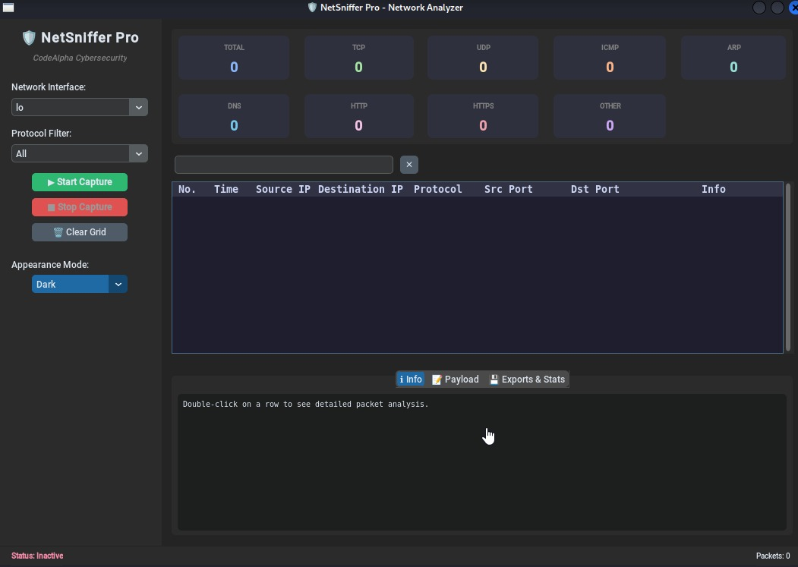

# 🛡️ NetSniffer Pro — Modern Network Sniffer

> CodeAlpha Cybersecurity Internship — Task 1: Basic Network Sniffer

A real-time network packet sniffer with a modern, dark-themed graphical interface built with **CustomTkinter** and **Scapy**. Capture, classify, and inspect live network traffic (TCP, UDP, ICMP, ARP, DNS, HTTP, HTTPS) directly from your desktop.


---

## ✨ Features

- **Live packet capture** on any network interface, in a dedicated background thread (UI never freezes)
- **Protocol classification**: TCP, UDP, ICMP, ARP, DNS, HTTP, HTTPS/TLS
- **Real-time statistics dashboard** with a live counter per protocol
- **Live search bar** — filter captured packets instantly by IP, port, or protocol as you type
- **Detailed packet inspector**:
  - Info tab — human-readable breakdown (IP/ports/flags/DNS query name...)
  - Payload tab — UTF-8 text view, hex dump, and a statistical analysis (entropy, printable ratio) to spot encrypted/compressed data
- **Export capture** to `.csv` (spreadsheet) or `.pcap` (opens directly in Wireshark)
- **Custom in-app file save dialog**, styled to match the app instead of the plain OS picker
- **Dark / Light / System appearance modes**

## 📸 Screenshot


```markdown
.
```


## ⚙️ Requirements

- Python 3.9+
- [Npcap](https://npcap.com/) (Windows only — required by Scapy for packet capture)
- Administrator / root privileges (packet capture requires raw socket access)

## 🚀 Installation

```bash
# Clone the repository
git clone https://github.com/<your-username>/netsniffer-pro.git
cd netsniffer-pro

# (Recommended) create a virtual environment
python3 -m venv venv
source venv/bin/activate      # Linux/macOS
venv\Scripts\activate         # Windows

# Install dependencies
pip install -r requirements.txt
```

## ▶️ Usage

```bash
# Linux / macOS — root privileges required
sudo python3 network_sniffer_ctk.py

# Windows — run your terminal as Administrator
python network_sniffer_ctk.py
```

1. Select your network interface from the sidebar
2. (Optional) choose a protocol filter — `tcp`, `udp`, `icmp`, `arp`, `dns`, `http`, `https`
3. Click **▶ Start Capture**
4. Double-click any row to inspect the packet's info and payload
5. Use the search bar to filter results live
6. Export your capture as CSV or PCAP when done

## 🗂️ Project Structure

```
netsniffer-pro/
├── network_sniffer_ctk.py   # Main application (GUI + capture logic)
├── requirements.txt         # Python dependencies
├── README.md                # This file
└── LICENSE
```

## ⚠️ Legal Notice

This tool is intended **strictly for educational purposes**. Only use it on networks you own or have explicit authorization to monitor. Unauthorized packet interception may violate local laws (e.g., wiretapping / computer misuse legislation).

## 🧰 Built With

- [Python](https://www.python.org/)
- [Scapy](https://scapy.net/) — packet crafting & sniffing
- [CustomTkinter](https://github.com/TomSchimansky/CustomTkinter) — modern Tkinter widgets

## 📄 License

This project is licensed under the MIT License — see the [LICENSE](LICENSE) file for details.

## 🙋 About

Built as part of the **CodeAlpha Cybersecurity Internship** — Task 1.
